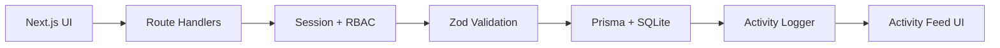
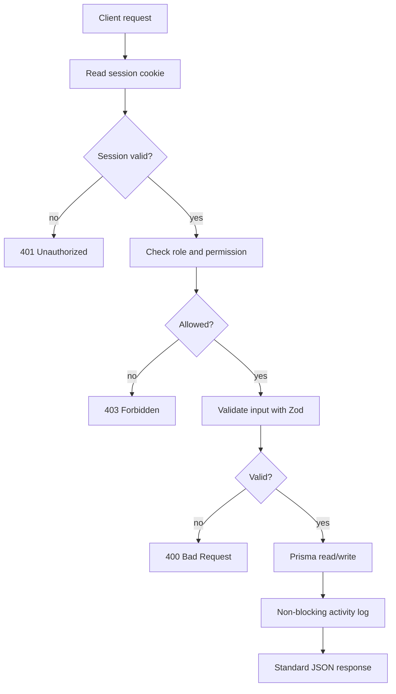
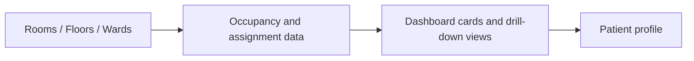
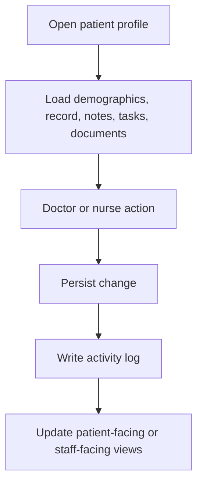
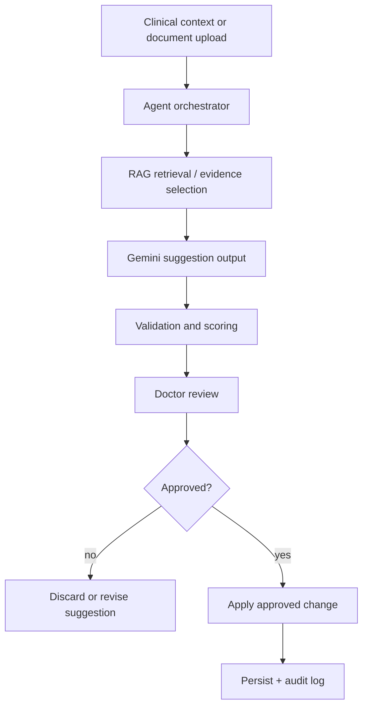

# MedBoard

MedBoard is a hospital operations platform for ward visibility, patient records, staff workflows, and auditable clinical actions. It gives doctors, nurses, and administrators a single operational view while keeping permissions, validation, and traceability explicit.

## What This Project Covers

- Ward, room, floor, and patient visibility in one application.
- Structured patient profiles with notes, documents, tasks, and schedules.
- Role-based access for doctor, nurse, admin, patient, and readonly users.
- Activity logging for every important state-changing action.
- A planned AI agent layer that suggests actions but never writes clinically without human approval.

## Quick Start

1. Run initial setup with `./setup.sh` or `make setup`.
2. Create local environment variables in `.env`.
3. Prepare Prisma and the database.
4. Start the app with `npm run dev` or `make dev`.

For cluster environments where `npm` is not on the host PATH, use the local Node installation under `/goinfre/$USER/node/bin`.

## Stack

| Area | Technology |
| --- | --- |
| Frontend | Next.js App Router, React, TypeScript, Tailwind CSS |
| Backend | Next.js route handlers under `src/app/api/**/route.ts` |
| Validation | Zod |
| Auth | JWT cookie sessions |
| Authorization | Explicit RBAC in `src/lib/permissions.ts` |
| Data | Prisma with SQLite |
| Audit trail | `src/lib/activity-logger.ts` |
| AI layer | Planned Gemini + RAG workflows |

## Repository Map

- `src/app/` contains routes, pages, and API handlers.
- `src/components/` contains feature-focused UI components.
- `src/lib/` contains shared backend logic, validation, auth, and helpers.
- `src/types/` contains shared API and domain types.
- `prisma/` contains the database schema and seed data.
- `future/` contains planned modules that are not part of the current runtime.

## Architecture

The request path is intentionally linear: authenticate, authorize, validate, persist, then log. That keeps the operational rules visible and reduces hidden coupling.

## Core Runtime Flows

### Authentication and Request Handling

### Operational Dashboard

### Patient Profile Workflow

## AI Agent Layer

The AI layer is planned and follows a strict suggestion-first model. It is designed to support intake assignment, document analysis, nurse task routing, and schedule suggestions while keeping a human approval gate before any clinical write action.

### Planned AI stack

- Gemini for extraction and synthesis.
- LangChain for retrieval and workflow composition.
- Qdrant for vector search.
- BullMQ and Redis for async execution later.
- Zod for output contract validation.

## Safety And Design Constraints

- Permission checks stay explicit in API routes.
- Validation uses `safeParse` and shared schemas.
- Error responses stay standardized.
- Audit logging must not block the main request path.
- AI suggestions remain non-autonomous until a human approves them.
- Secrets stay in environment files and are never hardcoded.

## Commands

- Setup: `./setup.sh` or `make setup`
- Dev server: `npm run dev` or `make dev`
- Production build: `npm run build`
- Production start: `npm start`
- Lint: `npm run lint`
- Prisma refresh after schema changes: `npx prisma generate` then `npx prisma db push`
- Seed data: `npx prisma db seed`
- Reset data: `make reset`

## Read Next

- [helper.md](helper.md)
- [IMPLEMENTATION_PLAN.md](IMPLEMENTATION_PLAN.md)
- [future/README.md](future/README.md)
- [future/agents/README.md](future/agents/README.md)
- [future/tasks/README.md](future/tasks/README.md)
- [future/alerts/README.md](future/alerts/README.md)
- [future/integrations/README.md](future/integrations/README.md)